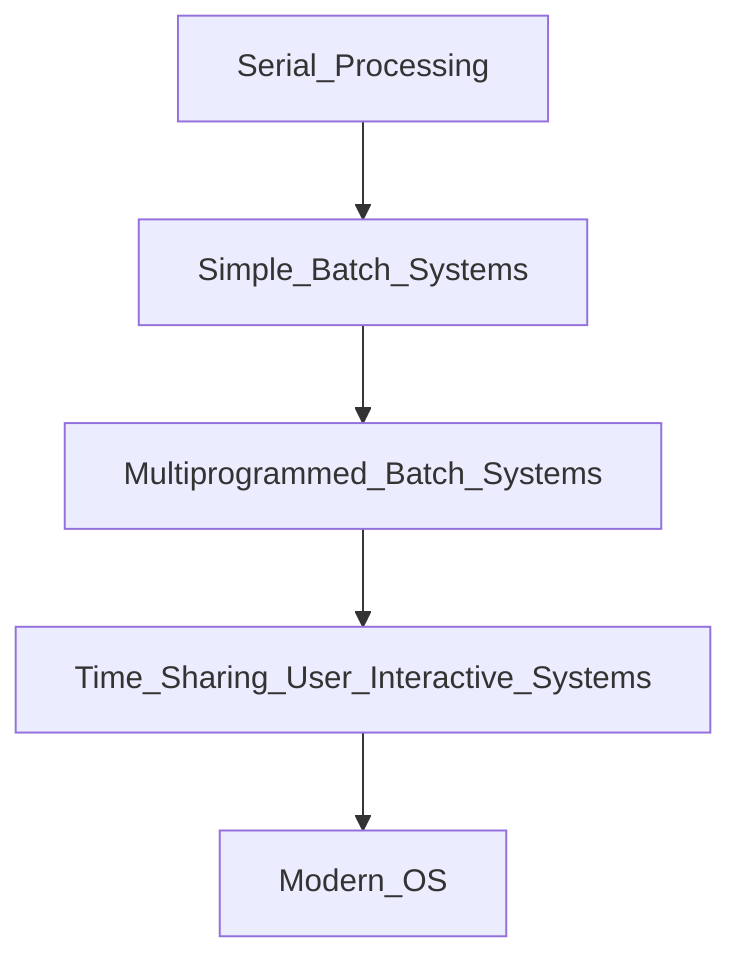

# Week 1:

## Notes

---

**Operating System**

- a program that controls the execution of user programs and acts as an intermediary between users and computer hardware
- software layer between application programs and computer hardware

**Execution Environment for Programs**

- OS provides an environment for executing programs
    - programs need resources for execution
        - processor - executing program instructions
        - computer memory - hold programs and data
        - I/O devices - communicate with outside world
    - OS provides a uniform abstract representation of resources that can be requested and accessed by applications
        - programmatic API - system calls for memory access, starting processes, accessing I/O devices (disk, network)

**User Experience**

- Modern OS
    - multiple programs may execute “at the same time”
        - virtual processing, context switch, scheduling, concurrency
    - programs execute in their own safe environment
        - virtual processing, virtual memorymanagement, context switch
    - multiple users may use a computer “at the same time”
        - virtual computer system, multi-user ability
    - programs may be much larger than actual physical memory
        - virtualization of memory, persistent storage, paging, swapping
- objectives
    - make computer systems
        - convenient
        - efficient
        - secure

**Core Concepts**

- Virtualization
    - virtual processing - multiple programs may execute due to process management
    - virtual memory - programs may be larger than actual memory due to virtualization of memory resources
- Concurrency
    - multiple programs may run concurrently and access shared data
        - can lead to problems
- Persistence
    - data can be stored persistently
    - OS has to protect data from corruption (recovery from system failure) and unauthorized access

**Evolution of OS**

**Serial Processing**

- no OS
- programmer interacted directly with computer hardware
- problem
    - setup time - considerable time spent on setting up program to run
        - direct access to all hardware
        - difficult to program
    - no concepts of automated job scheuling
        - users had to reserve computer time on a signup sheet
        - waste of capacity

**Simple Batch Processing**

- automatic execution of a sequence of “jobs”
    - user program, additional programs such as compilers, data to be processed
- resident monitor
    - first rudimentary OS
    - small program held permanently in memory
    - controls execution of jobs
        - control of processor is switched between monitor and jobs (user programs)
        - “job control language” describes how to execute a job, is interpreted by monitor
    - controls sequence of events
    - includes interpreter for a job control language
- activities
    - loading jobs
        - user program
        - additional programs such as compilers
        - data to be processed
    - load additional non-resident monitor elements and common functions needed by a program as sub-routines on demand
- funcdamental observations
    - user programs can be faulty
        - endangers whole computer system
        - may overwrite the memory area where the monitor/OS resides
        - job fails to return control to monitor (e.g. endless loop)
    - separation of concerns
        - many user programs will perform similar activities
            - provide a library of subroutines that implements fuinctions needed by all programs e.g. I/O operations
            - perform a switch between user program and a library subroutine when needed
- these are problems that still exist and influence the architecture of OS

**Protecting the OS Early Hardware Features**

- memory protection for monitor
    - hardware features for controlling user programs in their behaviour of accessing memory - disallow access to the memory area of the monitor
- privileged instructions
    - can only be executed by monitor
- timer
    - set time limits for activities, prevents a job from monopolising a system
- interrupts
    - CPU reacts to interrupts - interrupts the execution of the current program and executes an interrupt handling routine
    - interrupts give OS more flexibility in controlling user programs, allows I/O devices to communicate with CPU (interrupts as a communication means between hardware components)

**Protecting the OS Modern OS Concepts**

- memory protection
    - user program is allowed to alter only specific areas of memory
        - separation of memory in OS and user-specific areas
    - hardware detects such an error and aborts a job
- privileged instructions
    - certain instructions only the OS is allowed to execute
        - e.g. I/O instructions - a user program must relinqush control to the OS
    - hardware detects such an erro and aborts
- in modern OS this is implemented with “modes of operation”
    - user mode - certain areas of memory and instructions are protected/not accessible for user programs
    - kernel mode - only for OS functions, allows access to protected areas of memory and the execution of reserved instructions
